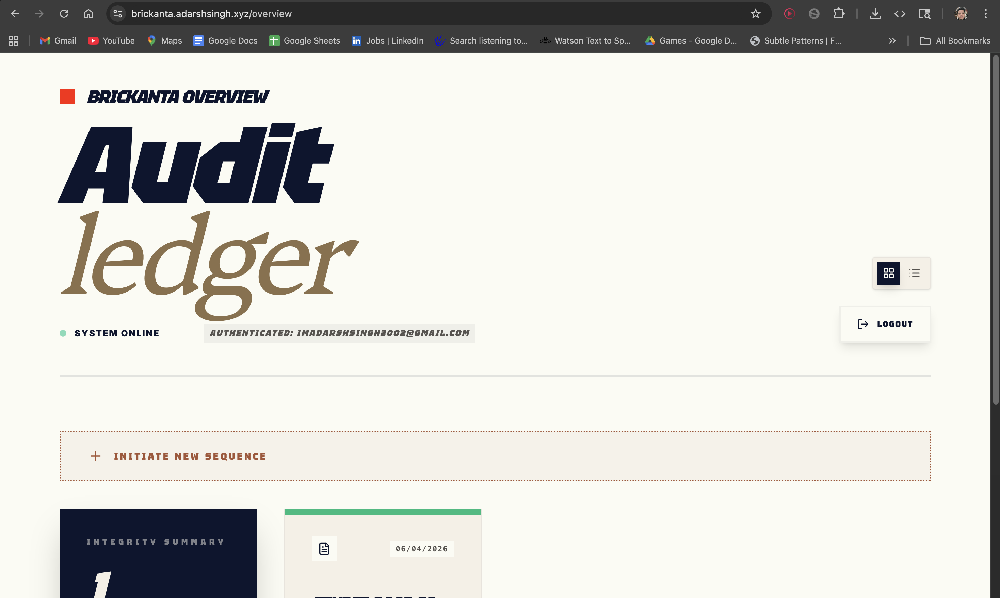
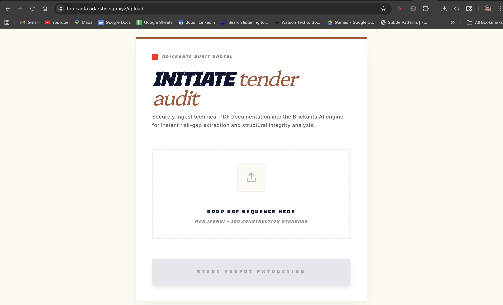
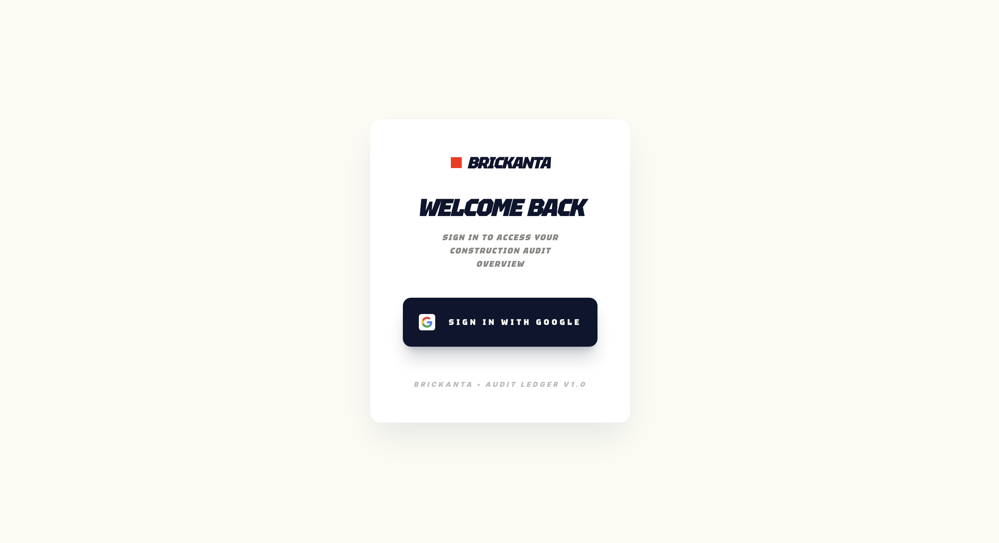
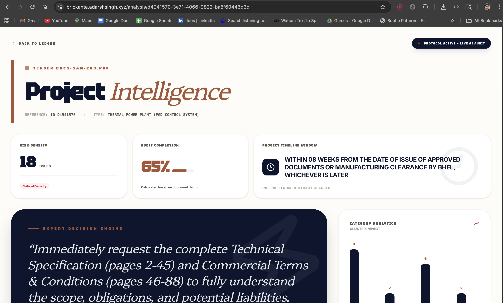
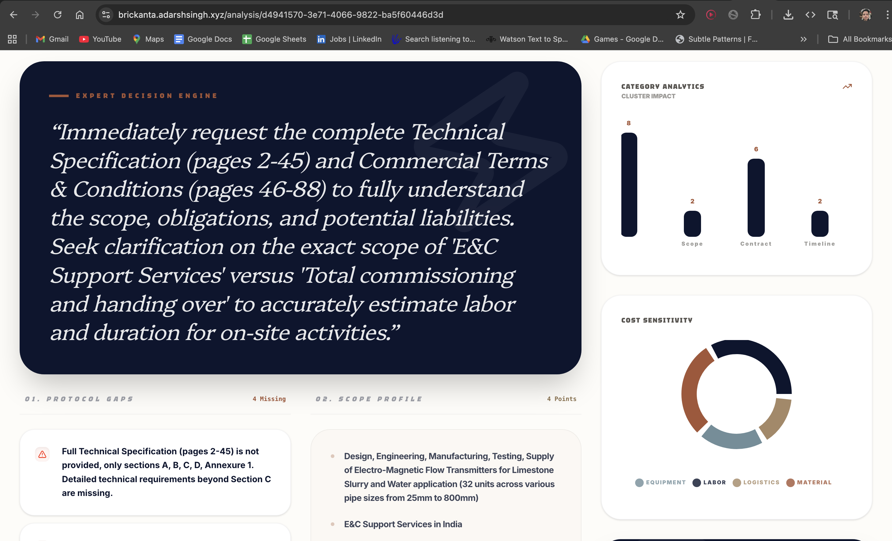
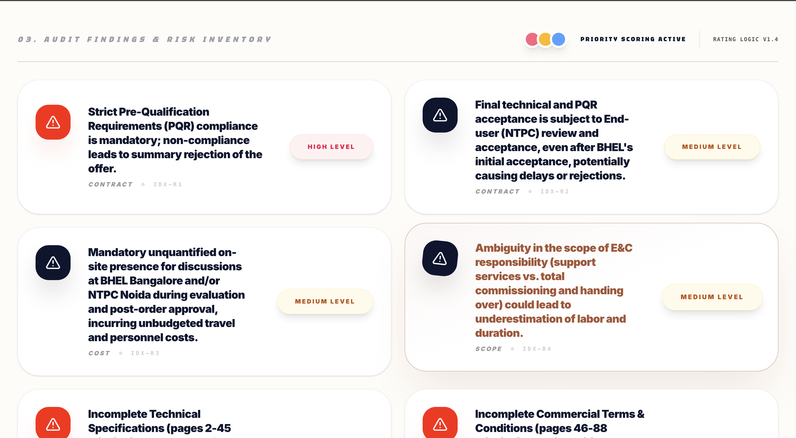

# 🏗️ Brickanta – Agentic AI for Society Builders (MVP)

<!-- > [!NOTE]
> **Brickanta is currently in MVP (Minimum Viable Product) stage.** We are actively iterating on the agentic analysis pipeline and ISO compliance engine. -->

Brickanta is an enterprise-grade AI platform designed for senior construction auditors and society builders. It automates the extraction of risk-gaps, structural integrity flaws, and technical compliance data from large-scale tender documentation.

Engage with an intelligent agentic engine that cross-references ISO construction standards against your technical PDF sequences, providing high-precision audits and risk inventory dashboards.

**🌐 Live Demo:** [Access Brickanta](https://brickanta.adarshsingh.xyz)

## ✅ Core Features

- 📄 **Technical PDF Ingestion** – Securely upload and manage complex construction tender sequences.
- 🧪 **AI Risk Extraction** – Instantly identify gaps, cost inconsistencies, and structural risks using advanced LLM reasoning.
- 🗄️ **Audit Ledger (Overview)** – A high-density, senior-grade dashboard for tracking all audit sequences and their completeness scores.
- 🤖 **Agentic Analysis Pipeline** – Multi-stage processing utilizing RAG (Retrieval-Augmented Generation) for cited, evidence-based results.
- 📊 **Structural Integrity Scoring** – Automated scoring system to evaluate document compliance and project risk at a glance.
- 🔄 **Background Processing** – Robust BullMQ integration for high-performance, asynchronous document chunking and embedding.
- 🔎 **Vector Search** – Powered by Qdrant to ensure lightning-fast retrieval of relevant clauses from thousands of document pages.

## 🛠 Tech Stack

### **Client (Frontend)**

- ⚛️ **Next.js 15+** – React framework for high-performance server-side rendering and intuitive routing.
- 🎨 **Tailwind CSS** – Custom-built design system with a premium, high-density construction aesthetic.
- ✨ **Shadcn UI** – Highly-customized UI components for a professional ledger experience.
- ⚡ **@tanstack/react-query** – Advanced state management and data fetching for real-time audit updates.
- 💡 **Lucide React & Tektur Font** – Modern typography and iconography for superior legibility.
- 🌗 **Next-Themes** – Sophisticated dark and light mode integration.

### **Server (Backend & AI)**

- 🟢 **tRPC** – End-to-end typesafe API layer for reliable communication between frontend and background workers.
- 🗄️ **PostgreSQL + Prisma** – Managed database on Supabase with a high-performance ORM layer.
- 🔒 **NextAuth.js v5** – Comprehensive authentication supporting Google OAuth for secure enterprise access.
- 📦 **Qdrant** – Distributed vector database for high-accuracy similarity search across massive document pools.
- ⚙️ **BullMQ + Redis** – Enterprise-ready job queue for handling intensive AI processing tasks in the background.
- 🧠 **Google Gemini 1.5 Pro** – State-of-the-art LLM for deep technical analysis and risk scoring.
- 🤗 **HuggingFace Inference** – Used for generating high-dimensional embeddings from technical document chunks.
- ⛓️ **LangChain** – Orchestrates the RAG pipeline, document splitting, and agentic workflows.

### **Infrastructure**

- 🐳 **Docker** – Containerized multi-service architecture (App, Worker, Redis, Postgres, Qdrant).
- 🐧 **Ubuntu EC2** – High-performance production deployment on AWS with Nginx reverse-proxying.
- 🚀 **GitHub Actions** – Professional CI/CD pipeline for automated testing, building, and deployment.

## Installation & Running Locally

Follow these steps to initialize Brickanta on your local infrastructure:

```bash
# 1. Clone the repository
git clone <your-repository-url>
cd tender-ai-audit

# 2. Install dependencies
npm install

# 3. Setup environment variables
cp .env.example .env
# Edit .env with your Google Gemini, Supabase, and Qdrant keys

# 4. Start Local Infrastructure (Redis, Qdrant, etc.)
docker-compose up -d

# 5. Initialize the Ledger
npx prisma generate
npx prisma db push

# 6. Boot the Core Services
npm run dev      # Start the Next.js portal
npm run worker   # Start the AI processing engine
```

## 📸 Screenshots

### 🔑 Secure Auth Portal



### 📊 Audit Ledger Overview



### 📤 Technical Document Ingestion



### 🧠 Agentic Risk Extraction



### 📋 Structural Integrity Report



### 🔍 Deep Compliance View



## 📄 License

This project is licensed under a **Custom Personal Use License** — you may view and learn from the code, but **commercial use, redistribution, or claiming authorship is strictly prohibited**. 
See the full [LICENSE](./LICENSE) for details.
